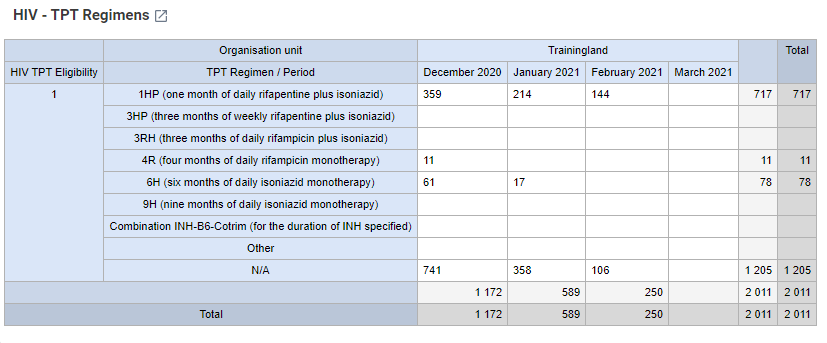
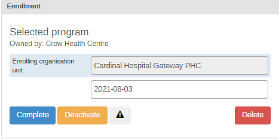
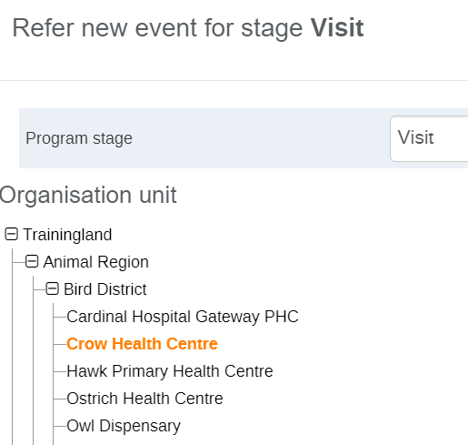
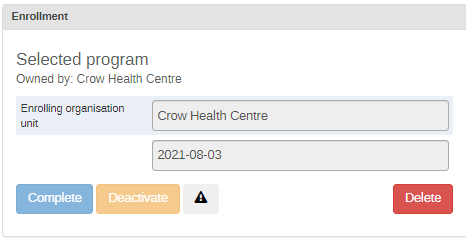

# HIV Case Surveillance Installation Guide { #hiv_cs_installation }

Last updated 29/09/2021

Package Version b1.0.0

DHIS2 Version compatibility 2.33.5 and above

## Overview

The HIV Case Surveillance tracker package was developed using DHIS2.33.5. This was done in order to support some of the latest features in DHIS2. In order to use the package, it is recommended that you install it into a DHIS2 instance using DHIS2 2.33.5 or above. If you will be setting this up on a new instance, please refer to the [DHIS2 installation guide](https://docs.dhis2.org/master/en/dhis2_system_administration_guide/installation.html). This document covers the installation of the following packages:

1. Case Surveillance tracker program

You will have to follow the instructions to ensure that the package is installed and configured correctly.

## Installation

Installation of the module consists of several steps:

1. [Preparing](#preparing-the-metadata-file) the metadata file.
2. [Importing](#importing-metadata) the metadata file into DHIS2.
3. [Configuring](#additional-configuration) the imported metadata.
4. [Adapting](#adapting-the-tracker-program) the program after being imported

It is recommended to first read through each section before starting the installation and configuration process in DHIS2. Sections that are not applicable have been identified, depending on if you are importing into a new instance of DHIS2 or a DHIS2 instance with metadata already present. The procedure outlined in this document should be tested in a test/staging environment before either being repeated or transferred to a production instance of DHIS2.

## Requirements

In order to install the module, an administrator user account on DHIS2 is required. The procedure outlined in this document should be tested in a test/staging environment before being performed on a production instance of DHIS2.

Great care should be taken to ensure that the server itself and the DHIS2 application is well secured, to restrict access to the data being collected. Details on securing a DHIS2 system is outside the scope of this document, and we refer to the [DHIS2 documentation](http://dhis2.org/documentation).

## Preparing the metadata file

**NOTE:** If you are installing the package on a new instance of DHIS2, you can skip the “Preparing the metadata file” section and move immediately to the section [Importing a metadata file into DHIS2](#importing-metadata)

While not always necessary, it can often be advantageous to make certain modifications to the metadata file before importing it into DHIS2.

### Default data dimension (if applicable)

In early versions of DHIS2, the UID of the default data dimension was auto-generated. Thus, while all DHIS2 instances have a default category option, data element category, category combination and category option combination, the UIDs of these defaults can be different. Later versions of DHIS2 have hardcoded UIDs for the default dimension, and these UIDs are used in the configuration packages.

To avoid conflicts when importing the metadata, it is advisable to search and replace the entire .json file for all occurrences of these default objects, replacing UIDs of the .json file with the UIDs of the database in which the file will be imported. Table 1 shows the UIDs which should be replaced, as well as the API endpoints to identify the existing UIDs.

|Object|UID|API endpoint|
|:--|:--|:--|
|Category|GLevLNI9wkl|`../api/categories.json?filter=name:eq:default`|
|Category option|xYerKDKCefk|`../api/categoryOptions.json?filter=name:eq:default`|
|Category combination|bjDvmb4bfuf|`../api/categoryCombos.json?filter=name:eq:default`|
|Category option combination|HllvX50cXC0|`../api/categoryOptionCombos.json?filter=name:eq:default`|

For example, if importing a configuration package into <https://play.dhis2.org/demo>, the UID of the default category option combination could be identified through <https://play.dhis2.org/demo/api/categoryOptionCombos.json?filter=name:eq:default> as bRowv6yZOF2.

You could then search and replace all occurrences of HllvX50cXC0 with bRowv6yZOF2 in the .json file, as that is the ID of default in the system you are importing into. **_Note that this search and replace operation must be done with a plain text editor_**, not a word processor like Microsoft Word.

### Indicator types

Indicator type is another type of object that can create import conflict because certain names are used in different DHIS2 databases (.e.g "Percentage"). Since Indicator types are defined simply by their factor and whether or not they are simple numbers without a denominator, they are unambiguous and can be replaced through a search and replace of the UIDs. This avoids potential import conflicts, and avoids creating duplicate indicator types. Table 2 shows the UIDs which could be replaced, as well as the API endpoints to identify the existing UIDs

|Object|UID|API endpoint|
|:--|:--|:--|
|Percentage|hmSnCXmLYwt|`../api/indicatorTypes.json?filter=number:eq:false&filter=factor:eq:100`|

### Tracked Entity Type

Like indicator types, you may have already existing tracked entity types in your DHIS2 database. The references to the tracked entity type should be changed to reflect what is in your system so you do not create duplicates. Table 3 shows the UIDs which could be replaced, as well as the API endpoints to identify the existing UIDs

|Object|UID|API endpoint|
|:--|:--|:--|
|Person|MCPQUTHX1Ze|`../api/trackedEntityTypes.json?filter=name:eq:Person`|

## Importing metadata

The .json metadata file is imported through the [Import/Export](https://docs.dhis2.org/master/en/user/html/import_export.html) app of DHIS2. It is advisable to use the "dry run" feature to identify issues before attempting to do an actual import of the metadata. If "dry run" reports any issues or conflicts, see the [import conflicts](#handling-import-conflicts) section below.

If the "dry run"/"validate" import works without error, attempt to import the metadata. If the import succeeds without any errors, you can proceed to [configure](#additional-configuration) the module. In some cases, import conflicts or issues are not shown during the "dry run", but appear when the actual import is attempted. In this case, the import summary will list any errors that need to be resolved.

### Handling import conflicts

**NOTE:** If you are importing into a new DHIS2 instance, you will not have to worry about import conflicts, as there is nothing in the database you are importing to to conflict with. Follow the instructions to import the metadata then please proceed to the “[Additional configuration](#additional-configuration)” section.

There are a number of different conflicts that may occur, though the most common is that there are metadata objects in the configuration package with a name, shortname and/or code that already exists in the target database. There are a couple of alternative solutions to these problems, with different advantages and disadvantages. Which one is more appropriate will depend, for example, on the type of object for which a conflict occurs.

**_Alternative 1_**

Rename the existing object in your DHIS2 database for which there is a conflict. The advantage of this approach is that there is no need to modify the .json file, as changes are instead done through the user interface of DHIS2. This is likely to be less error prone. It also means that the configuration package is left as is, which can be an advantage for example when training material and documentation based on the configuration package will be used.

**_Alternative 2_**

Rename the object for which there is a conflict in the .json file. The advantage of this approach is that the existing DHIS2 metadata is left as-is. This can be a factor when there is training material or documentation such as SOPs of data dictionaries linked to the object in question, and it does not involve any risk of confusing users by modifying the metadata they are familiar with.

Note that for both alternative 1 and 2, the modification can be as simple as adding a small pre/post-fix to the name, to minimise the risk of confusion.

**_Alternative 3_**

A third and more complicated approach is to modify the .json file to re-use existing metadata. For example, in cases where an option set already exists for a certain concept (e.g. "sex"), that option set could be removed from the .json file and all references to its UID replaced with the corresponding option set already in the database. The big advantage of this (which is not limited to the cases where there is a direct import conflict) is to avoid creating duplicate metadata in the database. There are some key considerations to make when performing this type of modification:

* it requires expert knowledge of the detailed metadata structure of DHIS2
* the approach does not work for all types of objects. In particular, certain types of objects have dependencies which are complicated to solve in this way, for example related to disaggregations.
* future updates to the configuration package will be complicated.

### Additional configuration

Once all metadata has been successfully imported, there are a few steps that need to be taken before the module is functional.

### Sharing

First, you will have to use the _Sharing_ functionality of DHIS2 to configure which users (user groups) should see the metadata and data associated with the programme as well as who can register/enter data into the program. By default, sharing has been configured for the following:

* Tracked entity type
* Program
* Program stages
* Dashboards

There are four user groups that come with the package:

* HIV CS- Admin
* HIV CS- Data capture
* HIV CS- Data Analysis

By default the following is assigned to these user groups

| Object | User groups |  |  |  |
|---|---|---|---|---|
|  | HIV - CS Admin | HIV CS- Data capture | HIV CS - Data analytics |  |
| Tracked entity type | XXX | Metadata: can edit and view Data: can view | Metadata: can view Data: can capture and view | Metadata: can view Data: ca view |
| Program | XXX | Metadata: can edit and view Data: can view | Metadata: can view Data: can capture and view | Metadata: can view Data: can view |
| Dashboards | XXX | Metadata: can edit and view Data: can view | Metadata: can view Data: can view | Metadata: can view Data: can view |
|  |  |  |  |  |

You will want to assign your users to the appropriate user group based on their role within the system. You may want to enable sharing for other objects in the package depending on your set up. Refer to the [DHIS2 Documentation](https://docs.dhis2.org/master/en/dhis2_user_manual_en/about-sharing-of-objects.html) for more information on configuring sharing.

### User Roles

Users will need user roles in order to engage with the various applications within DHIS2. The following minimum roles are recommended:

1. Tracker data analysis : Can see event analytics and access dashboards, event reports, event visualizer, data visualizer, pivot tables, reports and maps.
2. Tracker data capture : Can add data values, update tracked entities, search tracked entities across org units and access tracker capture

Refer to the [DHIS2 Documentation](http://dhis2.org/documentation) for more information on configuring user roles.

### Organisation Units

You must assign the program to organisation units within your own hierarchy in order to be able to see the program in tracker capture.

### Duplicated metadata

**NOTE:** This section only applies if you are importing into a DHIS2 database in which there is already meta-data present. If you are working with a new DHIS2 instance, you may skip this section.

Even when metadata has been successfully imported without any import conflicts, there can be duplicates in the metadata - data elements, tracked entity attributes or option sets that already exist. As was noted in the section above on resolving conflict, an important issue to keep in mind is that decisions on making changes to the metadata in DHIS2 also needs to take into account other documents and resources that are in different ways associated with both the existing metadata, and the metadata that has been imported through the configuration package. Resolving duplicates is thus not only a matter of "cleaning up the database", but also making sure that this is done without, for example, breaking potential integrating with other systems, the possibility to use training material, breaking SOPs etc. This will very much be context-dependent.

One important thing to keep in mind is that DHIS2 has tools that can hide some of the complexities of potential duplications in metadata. For example, where duplicate option sets exist, they can be hidden for groups of users through [sharing](https://docs.dhis2.org/master/en/user/html/sharing.html).

#### Data entry forms

* After registering the first (test) case, access the **Settings** menu in the tracker capture form and select **Show/Hide Widgets**
* Switch from **Timeline Data Entry** to **Tabular Data Entry**
* Make sure that **Enrollment**, **Feedback** and **Profile** widgets are selected. Click **Close**.
* Adjust the widgets on the screen as shown below:

Screenshot

#### Top Bar

* Access the **Settings** menu and select **Top bar settings**
* Select **Activate top bar**
* Select required information fields and assign their **Sort order**

|| Recommended fields | Sort order |
|---|---|
| Surname | 1 |
| Date of birth | 2 |
| This person is in viral supression | 3 |
| Viral load latest | 4 |
| Days without medicine | 5 |

* Click **Save**
* Return to the **Settings** menu. Click **Saved dashboard layout as default**. Lock layout for all users.

## Adapting the tracker program

Once the programme has been imported, you might want to make certain modifications to the programme. Examples of local adaptations that _could_ be made include:

* Adding additional variables to the form.
* Adapting data element/option names according to national conventions.
* Adding translations to variables and/or the data entry form.
* Modifying program indicators based on local case definitions.

However, it is strongly recommended to take great caution if you decide to change or remove any of the included form/metadata. There is a danger that modifications could break functionality, for example program rules and program indicators.

## Event Reports

There is currently (08/03/2021) a bug that prevents the importing event reports (JIRA-DHIS2-10163). This means that some of the event report dashboards need to be recreated manually after the import.

### 6.1.2HIV - Visit by Gender and Treatment Status


In order to recreate this pivot table, go to the app “event reports” and configure the following:

Table Style: Pivot table
Output type: Event
Program: HIV Case surveillance
Stage: Visit

Selected data items:
Program Attribute “Gender, M,F,TG”
Data Element “HIV - Treatment Status”

Periods:
This Month
Last three months

Organisation unit:
Select the corresponding org unit or level(Currently it is configured at national level)

### HIV - Visit by Treatment Status and District


In order to recreate this pivot table, go to the app “event reports” and configure the following:

Table Style: Pivot table
Output type: Event
Program: HIV Case surveillance
Stage: Visit

Selected data items:
Data Element “HIV - Treatment Status”

Periods:
Last Month

Organisation unit:
Select the corresponding org unit or level (Currently it is configured at national level)

Layout:
Report filter: Periods
Column dimensions: Data Element “HIV - Treatment Status”
Row Dimensions: Organisation units

### TPT Regimes


In order to recreate this pivot table, go to the app “event reports” and configure the following:

Table Style: Pivot table
Output type: Event
Program: HIV Case surveillance
Stage: Visit

Selected data items:
Data Element “HIV - TPT Eligibility”
Data Element “HIV - TPT Regimen”

Periods:
This month,Last Month, Last three months

Organisation unit:
Select the corresponding org unit (Currently it is configured as “User org unit”)

Layout:
Column dimensions: Organisation units, Periods
Row Dimensions: DE HIV TPT Eligibility, DE HIV - TPT Regimen

## Script Annex

In order to allow for analytics at the point of service when clients change the place where they receive treatment, we have created a script that will need to be installed on the instance.

### Step 1: Create a Table

First step is to create a new table in the database where we will log the OU selected when the user enrolls in a new TEI. Please note that only programinstanceid and organisationunitid columns are required. In this case the uid column has been added for clarity purposes. We could add any column required for auditing purposes (for example a timestamp with the creation date, etc…)

```SQL
CREATE TABLE public.enrollmentou (
    programinstanceid bigint NOT NULL,
    uid character varying(11),
    organisationunitid bigint
);

ALTER TABLE public.enrollmentou OWNER TO postgres;

ALTER TABLE ONLY public.enrollmentou
    ADD CONSTRAINT enrollmentou_pkey PRIMARY KEY (programinstanceid);

ALTER TABLE ONLY public.enrollmentou
    ADD CONSTRAINT uk_d3lsa2h8me94ksyp53l6rpe4g UNIQUE (uid);

CREATE INDEX index_enrollmentou ON public.enrollmentou USING btree (programinstanceid);

ALTER TABLE ONLY public.enrollmentou
    ADD CONSTRAINT fk_enrollmentou_programinstanceid FOREIGN KEY (programinstanceid) REFERENCES public.programinstance(programinstanceid);

ALTER TABLE ONLY public.enrollmentou
    ADD CONSTRAINT fk_enrollmentou_organisationunitid FOREIGN KEY (organisationunitid) REFERENCES public.organisationunit(organisationunitid);
```

Then, we define a function to be executed by a trigger. This function simply takes the NEW value(s) INSERTED or UPDATED in table programinstance (corresponding to an enrollment) stored in variable NEW and populates enrollementou table with them. It also makes sure that the new enrollment corresponds to program uid 'Xh88p1nyefp', HIV CS.

```SQL
@CREATE OR REPLACE FUNCTION log_enrollment_ou_changes()
  RETURNS TRIGGER 
  LANGUAGE PLPGSQL
  AS
$$
BEGIN
    IF NEW.programid = (SELECT programid FROM program WHERE uid = 'Xh88p1nyefp')
    THEN
        INSERT INTO enrollmentou (programinstanceid, uid, organisationunitid)
        VALUES(NEW.programinstanceid,NEW.uid,NEW.organisationunitid)
        ON CONFLICT (programinstanceid) DO NOTHING;
    END IF;

    RETURN NEW;
END;
$$;
```

Last step remaining is to create a trigger which will execute this function after an insert or update operation takes place in the programinstance table.

```SQL
CREATE TRIGGER enrollment_ou_changes
  AFTER INSERT OR UPDATE
  ON programinstance
  FOR EACH ROW
  EXECUTE PROCEDURE log_enrollment_ou_changes();
```

We check the table at present and verify that is empty:


After accessing the instance, we proceed to enroll a new case in the HIV CS program. The result is as follows:


Please note that the UID for this new TEI is qFdfVhUGFZ8.

Checking the table enrollmentou, we can see that a new row has been created.


It is possible to create a SQL view to provide the contents of enrollmentou table in a more user friendly way, so the user can easily check what the enrollment ou was for each TEI in the program. The SQL view is as follows:

```SQL
SELECT tei.uid as tei_uid, eou.uid as enrollment_uid, ou.name as enrollment_ou
FROM enrollmentou eou
INNER JOIN programinstance pi ON eou.programinstanceid = pi.programinstanceid
INNER JOIN trackedentityinstance tei ON pi.trackedentityinstanceid = tei.trackedentityinstanceid
INNER JOIN organisationunit ou ON eou.organisationunitid = ou.organisationunitid;
```

And the result is:


We can now verify the current enrollment OU and ownership OU are the same for this TEI:


Also in the UI:



### Step 2: Create a function and trigger on trackedentityprogramowner

We create the following function and trigger on table trackedentityprogramowner:

```SQL
CREATE OR REPLACE FUNCTION log_ownership_ou_changes()
  RETURNS TRIGGER 
  LANGUAGE PLPGSQL
  AS
$$
BEGIN
    IF NEW.programid = (SELECT programid FROM program WHERE uid = 'Xh88p1nyefp') AND
       NEW.lastupdated != NEW.created
    THEN
        UPDATE programinstance SET organisationunitid = NEW.organisationunitid
        FROM trackedentityprogramowner
        WHERE trackedentityprogramowner.trackedentityinstanceid = NEW.trackedentityinstanceid AND
            trackedentityprogramowner.trackedentityinstanceid = programinstance.trackedentityinstanceid;
        
    END IF;

    RETURN NEW;
END;
$$;

CREATE TRIGGER ownership_ou_changes
  AFTER INSERT OR UPDATE
  ON trackedentityprogramowner
  FOR EACH ROW
  EXECUTE PROCEDURE log_ownership_ou_changes();
```

Function log_ownership_ou_changes will be triggered when an INSERT or UPDATE takes place in trackedentityprogramowner. If the row affected corresponds to HIV program and the timestamp from update differs from the one stored in create (so it is an update of ownership), the enrollment ou in the programinstance table is updated accordingly.

We proceed to refer the patient, making a permanent move:



We can check that the ownership has changed to Crow Health Centre:

We also check the table in the database:


The OU ownership is “Crow Health Centre” but also that is the new enrollment OU as well, so the trigger successfully performed the update in the program instance table. If we refresh the browser, we see this:



Ownership and enrollment are the same.

Finally, we verify that nothing has changed in the enrollmentou table:


So we still have the information about the enrollment organization unit.
