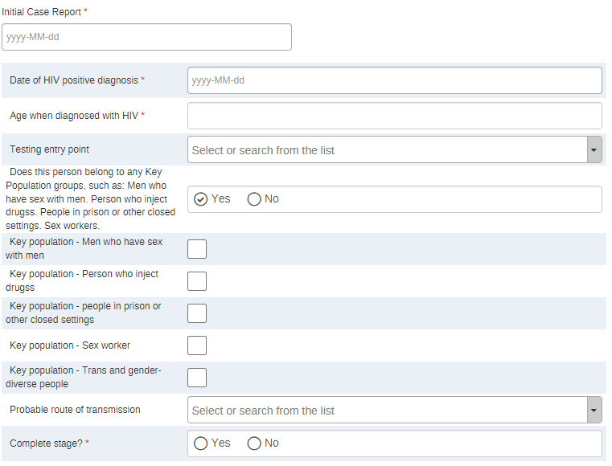
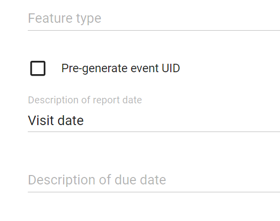

# HIV Case Surveillance System Design { #hiv-cs-design }

## Background and Purpose

The Case Surveillance component of the DHIS2 Toolkit for HIV is based on the latest WHO [Consolidated guidelines on person-centred HIV strategic information: strengthening routine data for impact](https://www.who.int/publications/i/item/9789240055315) (2022) and the Digital adaptation kit for HIV: operational requirements for implementing WHO recommendations and standards within digital systems, second edition.

This toolkit includes
- WHO-recommended dashboard analyses and core indicators for monitoring HIV care and treatment initiatives and using key metrics to adjust programming & drive impact 
- DHIS2 Tracker program aligned with the WHO Digital Adaptation Kit data standards for individual level data collection and operational person-centred monitoring at facility and community levels
- Aggregate data sets and data elements to model aggregated tracker data for performant, anonymized analytics 
- Data exchange mapping for aggregating DHIS2 tracker data for Case Surveillance indicators and integration of key indicators with national HMIS

The HIV toolkit is optimised for improving strategic information systems in countries to facilitate data-driven decision-making, as well as streamlining routine data management processes. The DHIS2 HIV Case Surveillance tracker is not designed to provide clinical decision-support for HIV care and treatment services, but rather serves as an operational tool and a source of individual level data for person-centred monitoring. 

The system design document explains the reference configuration in DHIS2 for the HIV Case Surveillance use case, including a detailed description of DHIS2 Tracker configuration, dashboard design, use of program indicators, mapping of tracker data to the aggregate data model, and data exchange mechanisms. This document also does not consider the resources and infrastructure needed to implement such a system, such as servers, power, internet connections, backups, training and user support, which can be found in the [DHIS2 Tracker Implementation Guide](https://docs.dhis2.org/en/implement/tracker-implementation/target-audience.html).

Reference metadata for this toolkit is available at: [dhis2.org/metadata-downloads](https://dhis2.org/metadata-downloads/).

### Acknowledgements

The HIV Case Surveillance toolkit has been developed in partnership with the WHO Global HIV Programme and the Pan American Health Organization (PAHO) with support from The Global Fund. We are grateful to WHO and PAHO for providing subject matter expertise in the design and development of these tools, as well as to the many countries who have shared their implementation experience with us

## System design overview

### Background

Background
Efforts to end the HIV epidemic by 2030 face persistent challenges, with 1.5 million new infections in 2020 alone. Key populations and their sexual partners constituted 70% of global new infections in 2021 (UNAIDS, 2022), highlighting barriers to equitable access. Paramount importance is to emphasise routine programmatic data for tracking service delivery, identifying at-risk individuals, and achieving universal access through a person-centred approach. Confidentiality and data privacy is crucial, especially for vulnerable populations that may be stigmatised, necessitating a cautious approach to individual-level data collection and anonymization for data use needs above the service delivery level.. 

A person-centred monitoring approach offers distinct advantages for longitudinal HIV data collection that can track and record HIV care and treatment services provided to an individual over time and space (e.g. different service delivery sites and touchpoints with HIV care and treament programmes). Scaling up individual level data collection allows for flexible disaggregation and enhanced analysis by various factors such as time, location, age, gender, clinical status, coinfections, treatment and more. This depth of information enhances our understanding of HIV epidemiology and facilitates ongoing monitoring of trends. Implementation of case-based electronic data is anticipated to enhance data quality by minimising data entry steps, integrating automatic calculations and validations, swiftly correcting or completing inconsistent or incomplete individual records, and facilitating de-duplication.

However, in most LMICs, the digitization of individual-level data systems managed by Ministries of Health often takes years to reach scale, and must be matched by substantial in-country resources to sustain the system over time. Furthermore, historical data and other programmatic data are often collected or represented through the aggregate data model – such as denominators based on Spectrum estimates for people living with HIV and aggregated reporting from paper-based service delivery sites with low/no connectivity, limited availability of devices and/or weak infrastructure. 

Therefore, the HIV Case Surveillance toolkit leverages all DHIS2 applications and data models to support practical, implementable approaches to collecting, analysing and using HIV Case Surveillance data effectively to manage and link newly identified HIV cases into treatment programs and ensure a proper monitoring of people living with HIV. These tools can be used in a modular way to meet the needs of any country along the maturity model for digitization of health data – including hybrid implementation of paper-based and digitised systems, as well as incorporating data from other electronic tools like hospital EMRs where these may be used.

### Use Case

The HIV Case Surveillance toolkit is designed to support routine data collection for programmes that support people living with HIV to enrol in a HIV program and receive HIV care and treatment services. The system is designed to bring data together to generate granular HIV Case Surveillance indicators and their disaggregations for routine data analysis, person-centred monitoring and strategic information through flexible dashboards and ad-hoc analysis with DHIS2 analytics tools. 

The data capture components of the system design allows for staff at service delivery sites, or higher levels depending on local contexts, to capture the core data elements during routine interactions with HIV  care and treatment programme participants that will allow programme staff to generate key performance indicators as detailed in WHO’s Consolidated guidelines for person-centred HIV strategic information (WHO, 2022). This component uses the DHIS2 Tracker data model. While DHIS2 HIV Case Surveillance tracker program is not optimised to support clinical case management or decision support, it serves as a useful electronic registry that supports decentralised electronic data capture of Case Surveillance data down to health facility or any other point of service from all types of actors. Individual level tracker data are aggregated using DHIS2 program indicators; which are mapped to aggregate data elements and data sets for populating core indicators and serving the analytical dashboards with anonymized data. 

The DHIS2 tracker program structure has been harmonised and follows the same logic as the HIV prevention Tracker, allowing for a person enrolled in a prevention program to enter the Case Surveillance program with a positive HIV diagnosis. In some contexts, it may be desirable to integrate prevention and Case Surveillance into a single tracker program. Harmonisation of data elements between the two trackers will allow for local adaptation and integration, described further in the ‘Implement’ section of this document. 

#### Intended users

The HIV Case Surveillance system design focuses on meeting the needs of end users at all levels of the health system, including those responsible for implementing HIV programmes in countries. These users may include:

- **HIV program managers & staff (national & sub-national)**: data users who are responsible for routine analysis of data, using data to improve operations and programme strategies, and providing data-driven feedback to programme staff, including implementing partners, facilities, and other service delivery points
- **HIV programme data managers**: users who are responsible for overseeing data collection, management, data quality, analysis and reporting functions for the national HIV programme
- **System admins/HMIS focal points**: MOH staff and/or core DHIS2 team responsible for maintaining and improving data systems for health programmes, integrating data streams into national platforms, providing technical support for system design, adaptation and end user support; and maintaining the DHIS2 system over time
- **Service delivery sites**: Staff at service delivery sites may use the DHIS2 Tracker program to record data for routine visits, as well as use DHIS2 tools like working lists and line-lists to follow up with clients and monitor individual-level uptake of services. 
- **Implementing partners**: organisations who provide technical assistance to the national HIV programme, collect and analyse data on behalf of the overall national programme strategy, and may be responsible for the operations of service delivery networks such as HIV counselling, educational outreach, community health workers.

### Design Structure

The DHIS2 HIV Case Surveillance configuration is structured in three major components:
- **Dashboards & Indicators**: the HIV Case Surveillance dashboards and indicators are all served by the aggregate data model in DHIS2. Case Surveillance dashboards are shared with the HIV HMIS module. 
- **Aggregate data sets**: aggregate datasets, data elements and associated category combinations are configured according to the WHO’s HIV analysis framework to populate the core indicators. Three datasets are designed to receive aggregated tracker data (e.g. via program indicators) and model this data in a performant way, leveraging the advantages of the aggregate data model in DHIS2 for analysis. Alternatively, these datasets can also be used for aggregate paper-based reporting; or to store data reported routinely from other individual-level data systems in use, such as sites using EMRs or other mobile applications. 
  - HIV Case Surveillance (monthly)
  - HIV Case Surveillance (yearly)
  - Population estimates 
- **Tracker program**: a DHIS2 tracker program has been configured for individual-level, longitudinal data collection. The tracker program can be used with the DHIS2 web or Android clients.

These modular components are designed based on the heterogeneous nature of HIV data systems in countries and support the typical architecture for implementing case-based data systems alongside integrated national HMIS infrastructure: 

## Tracker

### Tracker Program Structure

The tracker program structure is as follows:

| **Stage**           | **Description**                                              |
| ------------------- | ------------------------------------------------------------ |
| Enrollment          | The enrollment stage collects the basic demographic data about a person, including unique identifiers, as Tracked Entity Attributes (TEAs). Several of these core TEAs such as Family Name and Given name are shared across DHIS2 Tracker programs. The Tracked Entity Type for the HIV Case Surveillance program is ‘Person’. **The stage is non-repeatable.** |
| Initial case report | The stage can be filled at the same time as the enrollment of the patient.This stage contains the information related to HIV diagnosis and key population groups. **The stage is non-repeatable.** |
| Visit               | Main stage that collects all the information necessary for the follow-up of the patient and the program. **The stage is repeatable** |
|Follow-up | This stage is not tied to any indicators and is purely designed as a tool for recording any contact made with patients who have missed treatment visits and will need to be contacted. **The stage is repeatable**|

### Tracked Entity Type

The DHIS2 HIV Case Surveillance tracker program allows for the enrollment of a tracked entity type [TET] ‘person’ into the HIV Case Surveillance program. The TET type is shared with the HIV Prevention tracker to allow enrollment of the same TEI in both programs, in the case that a person receiving prevention services receives a positive HIV diagnosis.

### Enrollment

It is assumed that the HIV Case Surveillance workflow begins by enrolling any person with a confirmed HIV positive status.

When a person is enrolled in the HIV Case Surveillance program as a Tracked Entity Instance (TEI), Tracked Entity Attributes (TEA) are recorded to form the case profile. All TEAs are aligned and harmonised with those included in the HIV Prevention tracker allowing for enrollment in both programs or for integration into a single tracker program if desired at the local implementation level. Note that several TEAs are shared across non-HIV DHIS2 Tracker programs; these are configured with a prefix ‘GEN’ (general) to indicate they are shared between tracker programs. Check out the [Common Metadata Library](https://docs.dhis2.org/en/topics/metadata/dhis2-who-digital-health-data-toolkit/common-metadata-library/design.html) for more information on shared tracker metadata.

The TEA **program UID** attribute refers to an HIV program specific identifier. It has been kept intentionally blank as coding processes are dependent on local context. Refer to the [DHIS2 User Documentation on configuring system-wide unique identifiers as DHIS2 TEAs](https://docs.dhis2.org/en/use/user-guides/dhis-core-version-238/configuring-the-system/programs.html#create_tracked_entity_attribute:~:text=Select%20Unique%20to,same%20organisation%20unit.). The use of anonymous UID codes allows individuals accessing HIV prevention services to be uniquely identified and followed longitudinally, without the collection of other types of personally identifying information (WHO, 2022).

The **date of birth and age** can be assigned in two different ways:

- Known date of birth: select the Date of birth
- Unknown date of birth: select the Date of birth - Unknown option and then enter the age either in years or months.

Once done, a 'probable' age of birth is assigned to the Date of birth based on the value entered either on the years or month TEA.

**Note:**

The date of birth is configured as mandatory; it must always have a value because it is used in the calculation of all program indicators involving age groups

### Stage 1: Initial case report (non-repeatable)

The data acquired at this stage pertains to HIV diagnosis related information and the identification of clients belonging to one or multiple key population groups. 

Program rules have been configured to populate the age of HIV diagnosis based on the difference between the age of birth and the date of HIV diagnosis.

Concerning the key population information we recommend implementations to refer to WHO’s 2022 *Consolidated guidelines on person-centred HIV strategic information*, and specifically sections 2.2.2 for guidance on collecting information on key populations for prevention interventions to allow for this disaggregation, further considerations in section 5.1.1, and section 6.4 on maintaining data privacy, security and confidentiality as it relates to key population data captured.

Details of the HIV diagnosis and key population data is collected as a program stage in order to further protect the sensitive nature of this data. Specifically, by including this data only in the program stage, it is not accessible for searching a TEI – where users may have broader access to search for clients. 

In some implementations, instead of having the different key population groups listed as selectable categories, a set of questions has been proposed and according to the answer a key population identification is assigned to the clients. [See the section Implementation Considerations & Local Adaptation in this document](https://docs.google.com/document/d/1h7KBCLA99jVoTmDTBttIiSk4SKKD7tcIw7yq5A3yH68/edit#heading=h.7690t3h1dai8).

For an individual enrolled in an HIV Case Surveillance program, it is possible that their association with a key population group may change over time, as an individual’s risk of HIV acquisition, participation in high risk behaviours, and HIV prevention needs vary over time. The program stage is intentionally designed as non-repeatable to allow optimised analytics based on the key population group. However, a user may revisit this stage and modify the key population groups as needed.

### Stage 2: Visit [repeatable]

#### Configuration of Dates

This repeatable program stage captures all information relevant to visits/encounters for the person receiving HIV care and treatment services, regardless of which type of service they access. It allows for capturing multiple types of services provided in a visit. This is integral for a comprehensive, person-centred management and reporting system. 

In this program stage, the DHIS2 program ‘event date’ (or default ‘report date’ in the Maintenance app for program configuration) has been renamed to represent ‘Visit date.’ This means that all analytics based on the event date will evaluate based on the date of the person’s encounter (visit) with the HIV care and treatment service provider.

In addition to the visit date, additional key dates have been configured as Tracker domain data elements related to these activities (e.g. ART initiation, STI test date, etc.) and these should be reported to enable additional time-based analytics.

#### Visit details

The initial Visit Details section allows the user to report the patient status at the visit and as well select which HIV care and treatment services will be recorded for this visit report. 

The patient status is a key information that needs to be reported at every visit and it’s used in most of the indicators present in the program.
The set of options assigned is:
- PLHIV: the client is alive and is part of the cohort
- Death (documented): the client is dead
- Lost to follow up: the client is lost to follow up
In case ‘death’ or ‘follow up’ is selected, the relatives date of dead and declaration of lost to follow-up are requested

**Note:**

The recommended threshold for designation of people living with HIV on ART as lost to followup is 28 days after the last missed appointment or last ARV refill, to account for DSD ART. See chapter 3 of WHO's 'Consolidated guidelines on person-centred HIV strategic information' for additional information.

A series of program rules will show/hide the desired sections depending on which type of HIV care details will be recorded. It is generally assumed that the user will create a new Event in the Visit stage for each time they interact with a service provider, regardless of how many HIV care services they access during the visit. 

The ‘Currently pregnant’, ‘Cervical cancer’ and ‘Vertical transmission’ will only show for PLHIV enrolled with TEA ‘Sex assigned at birth’ as ‘Female’ or ‘Other’, based on program rules. 

**Note:**

Hiding a section does not erase the data that are recorded there and all the program indicators are NOT filtered by the selection or not of the section. In case there are any data that has been mistakenly entered, they will need to be removed manually one by one and not simply de-selecting the section

